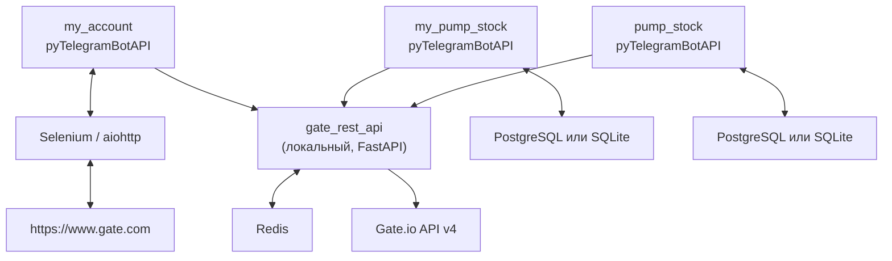

# Gate.io Service

Монорепозиторий. Сервисы для взаимодействия с биржей [Gate.io](https://www.gate.io): REST API‑прослойка и Telegram‑боты для мониторинга аккаунта и автоматизации.

---

## Проекты

| Проект | Описание |
|--------|----------|
| [**gate_rest_api**](./gate_rest_api) | Локальный REST API (FastAPI) для Gate.io: спот, кошелёк, лимиты запросов через Redis |
| [**my_account**](./my_account) | Telegram‑бот: баланс, расписание, парсинг страниц Gate.io (Selenium/aiohttp) |
| [**my_pump_stock**](./my_pump_stock) | Telegram‑бот с алгоритмами анализа «pump»‑активов, PostgreSQL или SQLite, работающими через Gate REST API |
| [**pump_stock**](./pump_stock) | Telegram‑бот с набором алгоритмов (1–5), PostgreSQL или SQLite, планировщик задач |

---

## Архитектура



- **gate_rest_api** — единая точка доступа к Gate.io API (ключи, лимиты, логи).
- **my_account** может обращаться к Gate.io напрямую и/или через `gate_rest_api` (в зависимости от конфига).
- **my_pump_stock** и **pump_stock** используют `gate_rest_api` и PostgreSQL или SQLite.

---

## Требования

- **Python**: 3.10+
- **Redis** — для `gate_rest_api` (лимитирование запросов)
- **PostgreSQL или SQLite** — для `my_pump_stock` и `pump_stock`
- **Docker** (опционально) — во всех проектах есть `Dockerfile` и `docker-compose`

---

## Быстрый старт

### 1. Gate REST API (общий слой)

```bash
cd gate_rest_api
pip install -r requirements.txt
# .env: GATE_KEY, GATE_SECRET, REDIS_HOST, REDIS_PORT, FASTAPI_PORT
uvicorn app:app --host 127.0.0.1 --port 3500
# Или: docker compose up -d
```

### 2. My Account (Telegram‑бот)

```bash
cd my_account
pip install -r requirements.txt
# .env: TELEGRAM_BOT_TOKEN, TELEGRAM_CHAT_ID, LOCAL_GATE_REST_API_IP,
#       LOCAL_GATE_REST_API_PORT, GATE_* …
python -m app
# Или: docker compose up -d
```

### 3. My Pump Stock

```bash
cd my_pump_stock
pip install -r requirements.txt
# .env: TELEGRAM_*, GATE_*, DB_*, LOCAL_GATE_REST_API_*
python -m app
# Или: docker compose up -d
```

### 4. Pump Stock

```bash
cd pump_stock
pip install -r requirements.txt
# .env: variable.env, gate.env, telegram.env, database.env
python -m app
# Или: docker compose up -d
```

---

## Конфигурация (общие переменные окружения)

| Переменная | Где используется | Описание |
|-----------|------------------|----------|
| `GATE_KEY`, `GATE_SECRET` | все проекты | API‑ключ и секрет Gate.io |
| `TELEGRAM_BOT_TOKEN`, `TELEGRAM_CHAT_ID` | боты | Токен Telegram‑бота и ID чата |
| `LOCAL_GATE_REST_API_IP`, `LOCAL_GATE_REST_API_PORT` | `my_account`, `my_pump_stock` | Адрес `gate_rest_api` |
| `REDIS_HOST`, `REDIS_PORT` | `gate_rest_api` | Параметры Redis для лимитов |
| `DB_HOST`, `DB_USERNAME`, `DB_PASSWORD`, `DB_SERVICE_NAME` | `my_pump_stock`, `pump_stock` | Параметры PostgreSQL или SQLite |

Точный список переменных смотрите в README или конфигурационных файлах каждого проекта.

---

## Структура

```text
gate_io_service/
├── README.md                 # этот файл
├── gate_rest_api/            # REST API (FastAPI, Redis)
│   ├── app.py
│   ├── views/                # spot, wallet, admin
│   ├── gate_wrapper/         # обёртка над gate-api
│   ├── Dockerfile, docker-compose.yaml
│   └── README.md
├── my_account/               # Telegram‑бот (аккаунт, баланс, парсинг Gate.io)
│   ├── app/
│   │   ├── __main__.py
│   │   ├── config.py, runners.py
│   │   ├── telebot_handler*.py
│   │   └── gate_wrapper/
│   ├── Dockerfile, docker-compose.yml
│   └── requirements.txt
├── my_pump_stock/            # Telegram‑бот (алгоритмы, PostgreSQL или SQLite)
│   ├── app/
│   │   ├── algorithm.py, runners.py
│   │   ├── database/
│   │   └── telebot_handler/
│   ├── Dockerfile, docker-compose.yml
│   └── requirements.txt
└── pump_stock/               # Telegram‑бот (алгоритмы, PostgreSQL или SQLite)
    ├── app/
    │   ├── algorithm.py, runners.py
    │   ├── database/
    │   └── telebot_handler/
    ├── Dockerfile, docker-compose.yml
    └── requirements.txt
```

---

## Документация проектов

- [gate_rest_api/README.md](./gate_rest_api/README.md) — API, эндпоинты, установка, Docker, тесты.
- У **my_account**, **my_pump_stock**, **pump_stock** детальная настройка задаётся через переменные окружения и файлы в `env/` (см. `docker-compose` и `config.py` в каждом проекте).

---

## Лицензия и контакты

Автор: Denis D. — gambit0095.mail@gmail.com.
